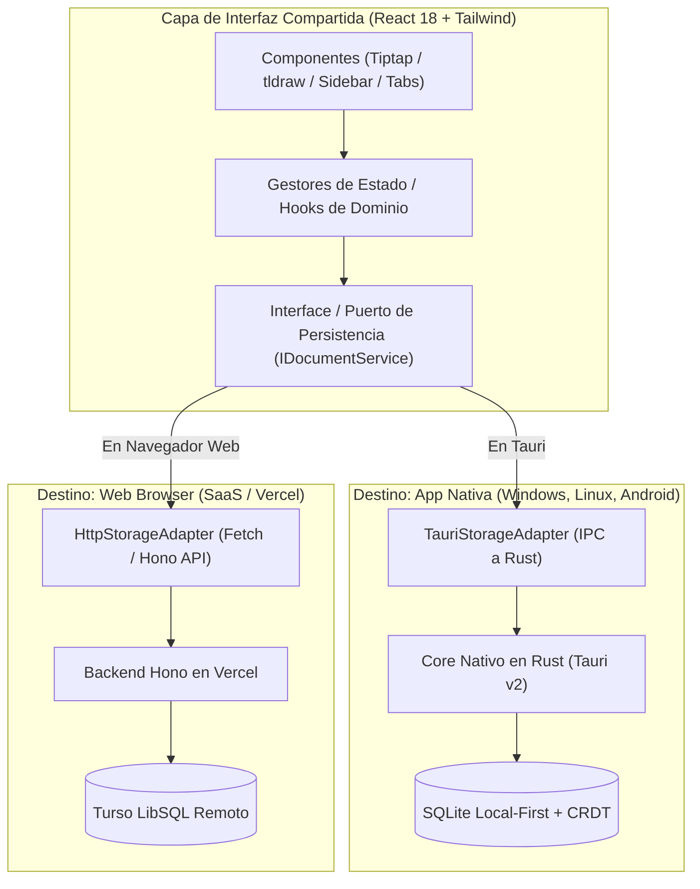

# Blueprint Técnico: Nout Nativo (Windows, Linux, Android) & Web Coexistente

Este documento define la arquitectura y el diseño técnico para que la **App Nativa Multiplataforma** de [Nout](file:///d:/Workspace/nout/README.md) y la **Plataforma Web (SaaS / Vercel)** **coexistan de forma armónica compartiendo el mismo núcleo de interfaz**.

---

## 1. Modelo de Coexistencia (Web + Native Dual Target)

La aplicación web existente continuará operando en la nube sin interrupciones. La app nativa añade una capa de alto rendimiento para escritorio y móviles mediante el principio de **Inversión de Dependencias (DIP)**:



### Principio de Diseño: Adaptador según Runtime
* **En el navegador web**: La app detecta `isTauri() == false` e interactúa directamente mediante llamadas HTTP tradicionales contra la API de Hono y Turso en la nube.
* **En la app nativa (Windows, Linux, Android)**: La app detecta `isTauri() == true` y delega la lectura/escritura a los comandos IPC de Rust, activando el motor Local-First con SQLite y caché local en disco.

---

## 2. Decisiones Arquitectónicas Fundamentales

| Componente | Decisión Técnica | Justificación Senior |
|---|---|---|
| **Estrategia de Código** | **Base de código unificada (Single Codebase)** | La UI (React, Vite, Tiptap, tldraw) vive en el mismo proyecto. La carpeta `src-tauri/` añade las capacidades nativas sin romper el build web para Vercel. |
| **Plataformas Objetivo** | Web (Navegador) + Windows (`x86_64`), Linux (`x86_64`), Android (`aarch64`) | Máxima cobertura con un único repositorio. |
| **Persistencia Nativa** | **Local-First con SQLite Embebido (`rusqlite`)** | Operatividad 100% offline y respuesta instantánea en dispositivos nativos. |
| **Versionado y Deltas** | **CRDTs Binarios (`yrs` / lib0 v2)** | Historial de versiones sin pérdida, Time-Travel y fusión sin conflictos. |
| **Colaboración en Vivo** | **PartyKit + Yjs Awareness sobre WebSockets** | Transmisión en tiempo real de cursores, selección y avatares (compatible tanto en web como en nativo). |
| **Autenticación** | **Híbrida** | *Web*: Login con Google/credenciales para acceder al cloud. *Nativa*: Uso local inmediato como invitado sin cuenta obligatoria; login para vincular y sincronizar. |
| **Multimedia** | **Caché Local + Cola Asíncrona (Nativo)** | Las imágenes y audios se guardan en el disco del dispositivo y se suben en background a Cloudinary/S3. |
| **Ergonomía UI** | **Diseño Adaptativo** | *Desktop*: Pestañas y split-panes. *Móvil*: Drawer deslizable, barra inferior y gestos táctiles. |

---

## 3. Arquitectura del Núcleo en Rust (`src-tauri/`)

Siguiendo las directrices de [seniorrustdeveloper.md](file:///d:/Workspace/.agents/rules/seniorrustdeveloper.md):
- Manejo estricto de errores con `Result<T, AppError>` y `thiserror` (sin `unwrap()` ni `expect()`).
- Canales Tokio [`tokio::sync::mpsc`](file:///d:/Workspace/.agents/rules/seniorrustdeveloper.md) para desacoplar el hilo IPC de las tareas de base de datos y red.
- Cero `clone()` superfluos; paso de referencias y estructuras con propiedad clara.

```
src-tauri/
├── Cargo.toml
├── tauri.conf.json
└── src/
    ├── main.rs                   # Entry point de la app nativa
    ├── lib.rs                    # Builder de Tauri y registro de plugins
    ├── error.rs                  # Enums de error de dominio (thiserror)
    ├── domain/                   # Entidades puras y tipos de dominio
    │   ├── document.rs           # Modelos de Documentos y tipos
    │   └── version.rs            # Deltas CRDT y Snapshots
    ├── storage/                  # SQLite embebido con rusqlite
    │   ├── db.rs                 # Gestión de conexión y migraciones
    │   └── repository.rs         # Consultas y transacciones ACID
    ├── sync/                     # Motor de fondo
    │   ├── queue.rs              # Canal mpsc para procesar cambios
    │   └── media_uploader.rs     # Tarea asíncrona de subida de adjuntos
    └── commands/                 # Handlers IPC invocados desde React
        ├── documents.rs          # CRUD de documentos y versiones
        ├── media.rs              # Almacenamiento local de fotos/audios
        └── system.rs             # Detección de plataforma y capacidades del SO
```

---

## 4. Esquema de Persistencia Local (SQLite Nativo)

```sql
-- Documentos en el dispositivo local
CREATE TABLE IF NOT EXISTS local_documents (
    id TEXT PRIMARY KEY NOT NULL,
    parent_id TEXT,
    title TEXT NOT NULL,
    doc_type TEXT NOT NULL CHECK(doc_type IN ('text', 'canvas')),
    is_favorite INTEGER NOT NULL DEFAULT 0,
    created_at INTEGER NOT NULL,
    updated_at INTEGER NOT NULL,
    deleted_at INTEGER,
    FOREIGN KEY(parent_id) REFERENCES local_documents(id) ON DELETE CASCADE
);

-- Deltas CRDT para versionado y Time-Travel
CREATE TABLE IF NOT EXISTS document_crdt_deltas (
    id INTEGER PRIMARY KEY AUTOINCREMENT,
    document_id TEXT NOT NULL,
    delta BLOB NOT NULL,              -- Actualización binaria Yjs/yrs (lib0 v2)
    created_at INTEGER NOT NULL,
    FOREIGN KEY(document_id) REFERENCES local_documents(id) ON DELETE CASCADE
);

-- Snapshots periódicos para optimizar el tiempo de arranque
CREATE TABLE IF NOT EXISTS document_snapshots (
    document_id TEXT PRIMARY KEY NOT NULL,
    snapshot BLOB NOT NULL,
    updated_at INTEGER NOT NULL,
    FOREIGN KEY(document_id) REFERENCES local_documents(id) ON DELETE CASCADE
);

-- Cola de sincronización hacia el servidor remoto (Turso/Hono)
CREATE TABLE IF NOT EXISTS sync_outbox (
    id INTEGER PRIMARY KEY AUTOINCREMENT,
    entity_type TEXT NOT NULL,         -- 'document', 'delta', 'media'
    entity_id TEXT NOT NULL,
    operation TEXT NOT NULL,           -- 'UPSERT', 'DELETE'
    payload TEXT NOT NULL,
    attempts INTEGER NOT NULL DEFAULT 0,
    created_at INTEGER NOT NULL
);

-- Caché local de multimedia (imágenes y audios)
CREATE TABLE IF NOT EXISTS local_media (
    id TEXT PRIMARY KEY NOT NULL,
    document_id TEXT NOT NULL,
    local_path TEXT NOT NULL,
    remote_url TEXT,
    mime_type TEXT NOT NULL,
    size_bytes INTEGER NOT NULL,
    sync_status TEXT NOT NULL CHECK(sync_status IN ('pending', 'uploaded', 'error')),
    created_at INTEGER NOT NULL
);
```

---

## 5. Hoja de Ruta de Implementación

### Fase 1: Setup de Tauri v2 sin Afectar la Web
- [ ] Configurar Tauri v2 en [nout](file:///d:/Workspace/nout) manteniendo intactos los scripts de dev y build web (`bun run dev`, `bun run build`).
- [ ] Configurar targets: Windows MSVC, Linux WebKitGTK y Android NDK (`cargo tauri android init`).
- [ ] Crear la capa de errores y tipos en `src-tauri/src/error.rs`.

### Fase 2: Puerto de Almacenamiento y Motor Local-First
- [ ] Implementar la interfaz `IDocumentStorageService` en TypeScript con dos estrategias:
  - `WebStorageAdapter`: llama a `/api/*` como hasta ahora.
  - `TauriStorageAdapter`: invoca los comandos nativos en Rust.
- [ ] Implementar en Rust el almacenamiento SQLite (`rusqlite`) y el motor de deltas CRDT (`yrs`).

### Fase 3: Adaptación Responsiva para Android
- [ ] Añadir selector de layout responsivo en React (escritorio: tabs y split-panes; móvil: drawer y vista simple).
- [ ] Optimizar gestos táctiles (zoom/pan con dos dedos) en [tldraw](file:///d:/Workspace/nout/src).
- [ ] Ajustar el viewport y el teclado virtual en Android para el editor [Tiptap](file:///d:/Workspace/nout/src).

### Fase 4: Caché Multimedia y Sincronización en Segundo Plano
- [ ] Manejador en Rust para guardar imágenes y audios localmente en el dispositivo.
- [ ] Tarea en segundo plano para subir adjuntos a Cloudinary/S3 cuando haya conexión.
- [ ] Sincronización bidireccional entre SQLite local y el backend Hono/Turso.

### Fase 5: Colaboración en Vivo (PartyKit) y Compilación Multiplataforma
- [ ] Validar compatibilidad de salas PartyKit y awareness tanto en web como en nativo.
- [ ] Compilar y probar instaladores:
  - Windows: `.msi` / `.exe`
  - Linux: `.deb` / `.AppImage`
  - Android: `.apk`
